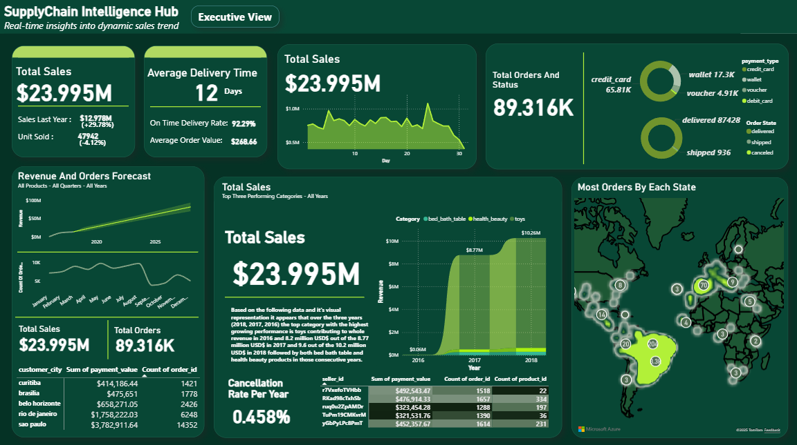

# E-commerce Order & Supply Chain Power BI Dashboard

A comprehensive end-to-end Power BI dashboard analyzing e-commerce operations, supply chain logistics, customer behavior, and business performance metrics.


---

## Table of Contents
- [Project Overview](#project-overview)
- [Dataset Information](#dataset-information)
- [Dashboard Features](#dashboard-features)
- [Key Performance Indicators](#key-performance-indicators)
- [Installation & Setup](#installation--setup)
- [Dashboard Pages](#dashboard-pages)
- [Data Model & Relationships](#data-model--relationships)
- [Key Insights](#key-insights)
- [Technologies Used](#technologies-used)
- [Project Structure](#project-structure)
- [Future Enhancements](#future-enhancements)
- [Contributing](#contributing)

---

## Project Overview

This project demonstrates a complete business intelligence solution for an e-commerce company, covering the entire order lifecycle from customer purchase to delivery. The dashboard provides actionable insights into sales performance, customer segmentation, order fulfillment, payment analysis, and product performance.

**Business Goals:**
- Monitor real-time sales and revenue metrics
- Analyze order status and fulfillment efficiency
- Track delivery performance against estimated dates
- Analyze customer purchasing patterns by geography
- Evaluate product performance and logistics
- Assess payment methods and installment trends

---

## Dataset Information

**Source:** [E-commerce Order & Supply Chain Dataset](https://www.kaggle.com/datasets/bytadit/ecommerce-order-dataset)

**Dataset Description:** Comprehensive e-commerce transactional data including orders, order items, customers, payments, and product information.

### Data Tables & Schema

#### 1. Orders Table
- **order_id**: Unique identifier for an order (Primary Key)
- **customer_id**: Unique identifier for a customer
- **order_status**: Status of the order (delivered, cancelled, processing, etc.)
- **order_purchase_timestamp**: When the order was placed
- **order_approved_at**: When the order was approved by seller
- **order_delivered_timestamp**: Actual delivery timestamp
- **order_estimated_delivery_date**: Estimated delivery date

#### 2. Order Items Table
- **order_id**: Unique identifier for an order (Foreign Key)
- **order_item_id**: Item sequence number within the order (Composite Primary Key)
- **product_id**: Unique identifier for a product (Foreign Key)
- **seller_id**: Unique identifier for the seller
- **price**: Selling price of the product
- **shipping_charges**: Shipping cost for the product

#### 3. Customers Table
- **customer_id**: Unique identifier for a customer (Primary Key)
- **customer_zip_code_prefix**: Customer's zip code
- **customer_city**: Customer's city
- **customer_state**: Customer's state

#### 4. Payments Table
- **order_id**: Unique identifier for an order (Foreign Key)
- **payment_sequential**: Sequence number for multiple payments on same order
- **payment_type**: Payment method (credit_card, debit_card, etc.)
- **payment_installments**: Number of installments (for credit cards)
- **payment_value**: Transaction amount

#### 5. Products Table
- **product_id**: Unique identifier for each product (Primary Key)
- **product_category_name**: Product category
- **product_weight_g**: Product weight in grams
- **product_length_cm**: Product length in centimeters
- **product_height_cm**: Product height in centimeters
- **product_width_cm**: Product width in centimeters

---

## Dashboard Features

### Interactive Visualizations
- **Sales Overview**: Revenue trends, order volume, and payment analysis
- **Order Status Tracking**: Distribution of orders by status (delivered, cancelled, processing)
- **Delivery Performance**: Actual vs estimated delivery time analysis
- **Geographic Analysis**: Sales and customer distribution by state and city
- **Product Performance**: Top products by revenue, category analysis, and dimensions impact
- **Payment Analytics**: Payment type distribution, installment trends, transaction values
- **Seller Performance**: Revenue by seller, order volume analysis
- **Shipping Cost Analysis**: Shipping charges vs product price, cost optimization

### Dynamic Filtering
- Date range selectors (purchase date, delivery date)
- Order status filters
- Customer state/city filters
- Product category filters
- Payment type filters
- Seller filters

### Key Metrics Cards
- Total Revenue
- Total Orders
- Average Order Value
- Total Customers
- On-Time Delivery Rate
- Average Delivery Time
- Order Fulfillment Rate
- Total Sellers

---

## Key Performance Indicators (KPIs)

### Sales & Revenue Metrics
- **Total Revenue**: Sum of all payment values
- **Total Orders**: Count of unique order IDs
- **Average Order Value (AOV)**: Total revenue / number of orders
- **Revenue by Product Category**: Sales breakdown by category
- **Revenue by Payment Type**: Payment method distribution
- **Average Shipping Cost**: Mean shipping charges per order

### Order Fulfillment Metrics
- **Order Status Distribution**: Percentage breakdown (delivered, cancelled, processing, etc.)
- **Order Completion Rate**: Delivered orders / total orders
- **Cancelled Order Rate**: Cancelled orders / total orders
- **Average Approval Time**: Time from purchase to approval
- **Orders per Seller**: Distribution of order volume across sellers

### Delivery Performance
- **On-Time Delivery Rate**: Orders delivered by estimated date / total delivered orders
- **Average Delivery Time**: Days from purchase to delivery
- **Delivery Delay**: Difference between actual and estimated delivery dates
- **Late Delivery Percentage**: Orders delivered after estimated date

### Customer Analytics
- **Total Customers**: Count of unique customer IDs
- **Customers by State**: Geographic distribution
- **Repeat Customer Rate**: Customers with multiple orders
- **Average Orders per Customer**: Total orders / unique customers

### Product Metrics
- **Top Products by Revenue**: Best-selling products
- **Product Category Performance**: Revenue by category
- **Average Product Weight**: Mean weight across all products
- **Products per Order**: Average order_item_id count per order

### Payment Analysis
- **Payment Type Distribution**: Percentage by payment method
- **Average Installments**: Mean installment count for credit card payments
- **Payment Value Trends**: Transaction amounts over time
- **Payment Success Rate**: Completed payments / total payment attempts

---

## Installation & Setup

### Prerequisites
- Microsoft Power BI Desktop (Latest Version)
- Dataset downloaded from Kaggle
- Basic understanding of Power BI and data modeling

### Setup Steps

1. **Download the Dataset**
   ```bash
   # Visit Kaggle and download the dataset
   https://www.kaggle.com/datasets/bytadit/ecommerce-order-dataset
   ```

2. **Clone this Repository**
   ```bash
   git clone https://github.com/yourusername/ecommerce-powerbi-dashboard.git
   cd ecommerce-powerbi-dashboard
   ```

3. **Open Power BI Desktop**
   - Launch Power BI Desktop
   - Click on "Get Data" > "Text/CSV" or "Excel" (depending on dataset format)

4. **Load the Data Tables**
   - Import all 5 tables: Orders, Order Items, Customers, Payments, Products
   - Click "Transform Data" to open Power Query Editor

5. **Data Transformation (Power Query)**
   - Ensure correct data types for all columns
   - Convert timestamp columns to DateTime format
   - Handle any null values appropriately
   - Create calculated columns if needed

6. **Create Data Model**
   - Go to "Model" view
   - Create relationships between tables:
     - Orders[order_id] → Order Items[order_id] (1:Many)
     - Orders[order_id] → Payments[order_id] (1:Many)
     - Orders[customer_id] → Customers[customer_id] (Many:1)
     - Order Items[product_id] → Products[product_id] (Many:1)

7. **Build the Dashboard**
   - Create calculated measures using DAX
   - Design visualizations for each dashboard page
   - Add filters and slicers

8. **Save and Publish**
   - Save as `Ecommerce_Dashboard.pbix`
   - Publish to Power BI Service (optional)

---

## Dashboard Pages

### 1. Executive Summary
High-level overview with key metrics including total revenue, orders, customers, and delivery performance. Includes trend analysis and order status distribution.

### 2. Sales Analysis
Detailed revenue analysis over time, payment type distribution, average order value trends, and revenue by product category.

### 3. Order Management
Order status tracking, approval time analysis, order processing efficiency, and seller performance metrics.

### 4. Delivery Performance
Comparison of actual vs estimated delivery dates, on-time delivery rate, average delivery time by state, and late delivery analysis.

### 5. Customer Insights
Customer distribution by geography, repeat customer analysis, orders per customer, and customer segmentation by state/city.

### 6. Product Performance
Top products by revenue, category analysis, product dimensions impact on shipping, and product weight distribution.

### 7. Payment Analytics
Payment method breakdown, installment trends, transaction value analysis, and payment sequential patterns.

---

## Data Model & Relationships

The data model follows a star schema design:

**Fact Tables:**
- Order Items (contains transactional data with price and shipping charges)
- Payments (contains payment transaction data)

**Dimension Tables:**
- Orders (contains order details and timestamps)
- Customers (contains customer geographic information)
- Products (contains product attributes)

**Relationships:**
```
Customers (1) ←→ (Many) Orders (1) ←→ (Many) Order Items (Many) ←→ (1) Products
                              ↓
                         (1) ←→ (Many)
                           Payments
```

---

## Key Insights

*Note: Add your actual insights after analyzing the data*

Example insights to look for:

**Order Analysis:**
- What percentage of orders are successfully delivered vs cancelled?
- What is the average time from order placement to approval?
- Which sellers have the highest order volume?

**Delivery Performance:**
- What is the on-time delivery rate?
- Which states have the longest delivery times?
- How accurate are the estimated delivery dates?

**Customer Behavior:**
- Which states have the most customers?
- What is the repeat purchase rate?
- What is the average order value by customer location?

**Product Insights:**
- Which product categories generate the most revenue?
- How does product weight impact shipping charges?
- What are the top 10 best-selling products?

**Payment Trends:**
- What is the most popular payment method?
- What percentage of customers use installment payments?
- What is the average number of installments?

---

## Technologies Used

- **Power BI Desktop**: Dashboard development and data visualization
- **Power Query (M Language)**: Data transformation and cleaning
- **DAX (Data Analysis Expressions)**: Calculated measures, columns, and tables
- **Data Modeling**: Star schema implementation with proper relationships
- **CSV/Excel**: Data source format

---

## Project Structure

```
ecommerce-powerbi-dashboard/
│
├── data/
│   ├── raw/
│   │   ├── orders.csv
│   │   ├── order_items.csv
│   │   ├── customers.csv
│   │   ├── payments.csv
│   │   └── products.csv
│   └── processed/                    # Cleaned and transformed data
│
├── images/
│   ├── dashboard_preview.png
│   ├── executive_summary.png
│   ├── sales_analysis.png
│   ├── delivery_performance.png
│   └── data_model.png
│
├── scripts/
│   └── dax_measures.txt              # Collection of DAX formulas
│
├── Ecommerce_Dashboard.pbix          # Main Power BI file
├── Data_Model_Documentation.pdf      # Data model and relationships
├── README.md                          # This file
└── LICENSE                            # License information
```

---

## Sample DAX Measures

Here are some essential DAX measures for this dashboard:

```dax
// Total Revenue
Total Revenue = SUM(Payments[payment_value])

// Total Orders
Total Orders = DISTINCTCOUNT(Orders[order_id])

// Average Order Value
Average Order Value = DIVIDE([Total Revenue], [Total Orders])

// On-Time Delivery Rate
On-Time Delivery Rate = 
DIVIDE(
    CALCULATE(
        COUNTROWS(Orders),
        Orders[order_delivered_timestamp] <= Orders[order_estimated_delivery_date]
    ),
    CALCULATE(
        COUNTROWS(Orders),
        Orders[order_status] = "delivered"
    )
)

// Average Delivery Days
Average Delivery Days = 
AVERAGEX(
    FILTER(Orders, Orders[order_status] = "delivered"),
    DATEDIFF(Orders[order_purchase_timestamp], Orders[order_delivered_timestamp], DAY)
)

// Cancelled Order Rate
Cancelled Order Rate = 
DIVIDE(
    CALCULATE(COUNTROWS(Orders), Orders[order_status] = "cancelled"),
    COUNTROWS(Orders)
)
```

---

## Future Enhancements

- [ ] Add seller dimension analysis with performance metrics
- [ ] Implement customer cohort analysis
- [ ] Create product recommendation engine based on purchase patterns
- [ ] Add freight cost optimization analysis
- [ ] Implement forecasting for order volume and revenue
- [ ] Create mobile-optimized dashboard version
- [ ] Add real-time data refresh capabilities
- [ ] Implement anomaly detection for unusual orders
- [ ] Create automated email reports for key stakeholders
- [ ] Add drill-through pages for detailed order investigation
- [ ] Implement row-level security for multi-user access

---

## Contributing

Contributions are welcome! Please follow these steps:

1. Fork the repository
2. Create a feature branch (`git checkout -b feature/AmazingFeature`)
3. Commit your changes (`git commit -m 'Add some AmazingFeature'`)
4. Push to the branch (`git push origin feature/AmazingFeature`)
5. Open a Pull Request

---

## Acknowledgments

- Dataset provided by [Bytadit on Kaggle](https://www.kaggle.com/bytadit)
- Power BI community for inspiration and best practices
- Microsoft Power BI documentation and tutorials

---

## Screenshots

### Dashboard Preview


### Sales Analysis Page


### Delivery Performance Page


### Data Model


---

**If you found this project helpful, please give it a star!**

**Happy Analyzing!**
